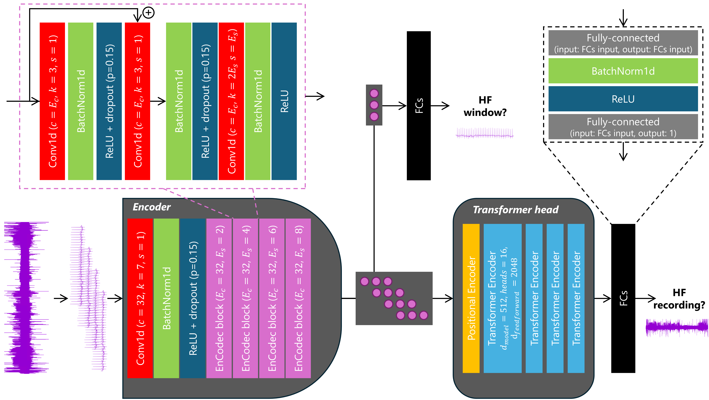

# DeepHHF: Modeling Day-Long ECG Signals to Predict Heart Failure Risk with Explainable AI

This is the Deep Holter Heart Failure Model (DeepHHF) for predicting 5-year HF risk from 24-hour ECG recordings.

## Abstract
Heart failure (HF) affects 10% adults aged 65 and older, reducing quality of life and longevity. Preventing HF can lower
morbidity and mortality. We hypothesized that artificial intelligence (AI) applied to 24-hour single-lead
electrocardiogram (ECG) data could predict HF risk within five years. To explore this, the Technion-Leumit Holter ECG
(TLHE) dataset was created, including 69,663 recordings from 47,729 patients, collected over 20 years. Our deep learning
model, DeepHHF, trained on 24-hour ECG recordings, achieved an area under the receiver operating characteristic curve of
0.80 outperforming a model using 30-second segments and a clinical score. High-risk individuals identified by DeepHHF
had a two-fold chance of forthcoming hospitalization or death. Explainability analysis showed DeepHHF focused on
arrhythmias and heart abnormalities, with key attention between 8 AM and 3 PM. This study highlights the feasibility of
deep learning to model 24-hour continuous ECG data, capturing paroxysmal events and circadian variations essential for
reliable risk prediction. AI applied to single-lead Holter ECGs is non-invasive, inexpensive, and widely accessible,
making it a promising HF risk prediction tool.

## DeepHHF model overview


The full 24-hour recording is split to 30-second windows, then going into the encoder, which outputs features for each
window. The encoder includes EnCodec blocks, adopted
from  [D´efossez et al.](https://github.com/facebookresearch/encodec) These blocks are changing according to their
parameters Ec (number of convolution filters) and Es (convolution stride). Next, in the first training step, each window
features are going into fully-connected layers (FCs)
block (black frame) for window HF prediction. In the second training step, all windows are used together as input to the
transformer head, added with positional encoding, and through three transformer encoders. For the final prediction of
the recording, the output of the transformer head is going through a different set of FCs.

## Instructions
1. Install the conda virtual environment as specified in 'environment.yml'.
```bash
conda env create -f environment.yml
conda activate DeepHHF
```

2. Run the model on sample test recordings using 'main.py'.
```bash
python main.py
```
You can modify the script by commenting/uncommenting specific example indices to test different recordings.

## Data
We provide four sample Holter ECG recordings from the TLHE dataset, all of which were part of the test set.

- HF-positive samples (high risk):
  - 33217 and 24625: Labeled as HF and correctly identified as high risk by DeepHHF.

- Non-HF samples (low risk):
  - 4623 and 15740: Labeled as non-HF and correctly identified as low risk by DeepHHF.

## Preprocess
Before being input into the model, the recordings undergo preprocessing:
1. Standardized Duration: Trimmed or padded to exactly 24 hours.
2. Downsampling: A 30-second window is extracted from each 2-minute segment, forming a 6-hour compressed representation.
3. Tensor Conversion: The processed data is transformed into a PyTorch Tensor for model inference.
